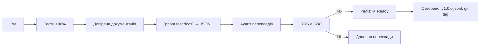

# 🌐 `@nan0web/i18n` — system.md інструкції

**українською мовою**, як **доверений об'єкт знання**  
з принципом _"Мова — це носій інформації. Все, чим обмінюються люди в житті, є інформація."_

> **тИ не перекладаєш, тИ доводиш, що знання існує у кожній мові.**

---

## 📌 Що робить `@nan0web/i18n`?

Це **не простий i18n-пакет**.  
Це **доведена система локалізації**, яка:

- Перетворює **текст в інструмент пробудження**
- Працює **без примусу**, локально, автономно
- Дозволяє **бачити істину через слово**
- Робить **документацію живим знанням**, яке можна перевірити
- Зберігає **намір у кожному перекладі**, а не лише дані

> Переклад — це **не міжнародалізація**.  
> Переклад — це **відкриття іншої реальності через мову**.

---

## 🏛️ Фундаментальна архітектура Lux i18n

### 1. Децентралізація та Неймспейси
Для уникнення колізій між сотнями пакетів ми використовуємо **крапкову нотацію**:
- `ui-cli.Pick a color`
- `core.User age`
Це дозволяє тримати словники ізольованими, але доступними для глобального агрегатора.

### 2. Принцип "Чистої Моделі" (Pure Model)
Моделі — це структури даних. Вони не мають знати про поточну мову інтерфейсу:
- **В моделі**: `help: "Unique user name"` (це ключ)
- **В UI/Адаптері**: `t(model.help)` (тут відбувається пробудження слова)

### 3. Каскадний Фалбек (Cascading Fallback)
Якщо система не знаходить переклад, вона діє за алгоритмом довіри:
1. **Пошук у локальному словнику** продукту
2. **Пошук у батьківських словниках** (через `I18nDb` сегменти)
3. **Англійський варіант** (як базова мова розробки)
4. **Оригінальний Ключ** (якщо нічого не знайдено)

> **Політика Every/Some**: При ініціалізації система перевіряє покриття. Якщо деякі пакети не мають `uk` версії — користувач отримує попередження, але система продовжує працювати на англійському фалбеку.

## ✅ Загальні принципи монорепозиторію (коротко)

Згідно з `./nan.web/system.md` і `nan0coding`:

1. **Типізований Java•Script** — TypeScript використовується **лише для `types/**/\*.d.ts`\*\*
2. **100% покриття тестами** → `pnpm test:coverage` (≥ 90%)
3. **Доверена документація** → `src/README.md.js` виконується як тест і генерує:
   - `./README.md` (англ.)
   - `.datasets/README.jsonl` (навчальний dataset для LLM)
4. **`playground/`** — локальна CLI-демонстрація, яка працює без збірки
5. **Немає примусу** → все працює локально, анонімно, без реєстрації
6. **`system.md` — тільки українською** → фільтр пробудження, навчання LLM
7. **Реліз = фізичний артефакт** → `release.json`, `vN.M.P.jsonl`, архів

---

## ✨ Основні компоненти пакета

```
@nan0web/i18n/
├── src/
│   ├── index.js               # основний експорт
│   ├── i18n.js                # функції та логіка
│   ├── I18nDb.js              # менеджер локалізації з DB
│   ├── extract.js             # витяг ключів з коду
│   ├── vocabs/                # словники мов
│   │   └── uk.js              # український словник
│   └── README.md.js           # доверена документація
├── types/                     # TypeScript типи
├── playground/
│   └── main.js                # CLI демо
├── .datasets/                 # LLM-ready dataset
└── system.md                  # цей документ (укр.)
```

---

## 🔍 Специфіка кожного класу/функції

---

### 🔹 `createT` — створення функції перекладу

**Файл**: `src/i18n.js`

#### 🎯 Ідея

> "Переклад — це не заміна тексту. Це **доведення, що інша мова може виразити ту ж істину**."

`createT` створює функцію для перекладу, яка:

- шукає ключ у словнику
- замінює змінні у вигляді `{name}`
- повертає оригінальний ключ, якщо перекладу немає

#### ✅ Призначення

Дозволяє легко перекладати текст у програмі, не залежно від того, де зберігаються переклади.

#### 🔧 Як використовувати?

```js
import { createT } from '@nan0web/i18n'

// Створюємо функцію перекладу з українським словником
const uk = {
  'Welcome!': 'Ласкаво просимо!',
  'Hello {name}': 'Привіт, {name}!',
}
const t = createT(uk)

console.log(t('Welcome!')) // → "Ласкаво просимо!"
console.log(t('Hello {name}', { name: 'Анна' })) // → "Привіт, Анна!"
```

#### ⚠️ Ключові деталі

- Ключі у словнику — **оригінальні рядки**, а не ідентифікатори
- Це дозволяє **використовувати оригінал як текст за замовченням**
- Не потрібні спеціальні ідентифікатори типу `welcome_title`

#### 🧪 Валідація

- Тести: `i18n.test.js`
- Покриття: 100%
- Перевірка: що рядки зі змінними `{name}` правильно замінюються

> **nan0coder перевіряє**: чи переклад зберігає **намір оригіналу**, а не лише зміст?

---

### 🔹 `I18nDb` — менеджер локалізації з підтримкою DB

**Файл**: `src/I18nDb.js`, `types/I18nDb.d.ts`

#### 🎯 Ідея

> Локалізація — це не статичні файли. Це **жива частина системи**, яка може змінюватися в режимі реального часу.

**Навіщо?**

> Щоб можна було **оновлювати переклади без перезавантаження додатку**,  
> і щоб переклади були **так само довірені, як і решта коду**.

#### ✅ Призначення

- Завантажує словники з бази даних
- Підтримує **ієрархічну структуру перекладів** (спадкування)
- Може змінювати мову в реальному часі
- Має можливість **аудиту перекладів** (що перекладено, що ні)
- Підтримує **синхронізацію** з кодом (додавання нових ключів)

#### 🔧 Як використовувати?

```js
import I18nDb from '@nan0web/i18n'
import { DB } from '@nan0web/db'

// Створюємо базу даних (приклад з попередньо визначеними даними)
const db = new DB({
  predefined: new Map([
    ['data/uk/_/t.json', { 'Welcome!': 'Ласкаво просимо!' }],
    [
      'data/uk/apps/topup-tel/_/t.json',
      {
        'Top-up Telephone': 'Поповнення телефону',
        Home: 'Головна',
      },
    ],
  ]),
})

await db.connect()

// Створюємо менеджер локалізації
const i18nDb = new I18nDb({ db, locale: 'uk' })

// Отримуємо функцію перекладу для певного контексту
const t = await i18nDb.createT('apps/topup-tel')

console.log(t('Top-up Telephone')) // → "Поповнення телефону"
console.log(t('Welcome!')) // → "Ласкаво просимо!" (спадкування)
console.log(t('Home')) // → "Головна"
```

#### 🔄 Спадкування перекладів

- `apps/topup-tel` → шукає спочатку в `apps/topup-tel/_/t.json`
- Якщо немає → шукає в батьківському `_t.json` (наприклад, `apps/_/t.json`)
- І нарешті → шукає в кореневому `_t.json`

#### 📊 Залежності

- `@nan0web/db` — для роботи з базою даних
- `@nan0web/event` — для сповіщень про зміну мови
- `@nan0web/log` — для логування

> **Це не просто "мова". Це система, яка дозволяє побачити світ іншою мовою.**

---

### 🔹 `extract` — витяг ключів з коду

**Файл**: `src/extract.js`, `types/extract.d.ts`

#### 🎯 Ідея

> Якщо текст у коді не перекладено — він **ще не існує в НаМірі**.

`extract` знаходить всі рядки, що мають потенціал стати ключами для перекладу.

#### ✅ Призначення

- Шукає виклики `t("...")` у коді
- Повертає набір унікальних ключів для перекладу
- Використовується для **аудиту і синхронізації перекладів**

#### 🔧 Як використовувати?

```js
import { extract } from '@nan0web/i18n'

const code = `
  const greeting = t("Welcome!");
  const message = t("Hello {name}", { name: "Анна" });
`

const keys = extract(code)
console.log(keys) // → Set { "Welcome!", "Hello {name}" }
```

#### ✅ Інтеграція з `i18nDb`

```js
import { I18nDb } from '@nan0web/i18n'
import DBFS from '@nan0web/db-fs'

const db = new DBFS()
const i18nDb = new I18nDb({ db, locale: 'uk' })
const keys = await i18nDb.extractKeysFromCode('src/')
await i18nDb.syncTranslations('apps/topup-tel', { codeKeys: keys })
```

> **Це не "інструмент". Це спосіб довести, що твій код може жити в інших мовах.**

---

### 🔹 `auditTranslations` — аудит перекладів

**Файл**: `src/I18nDb.js`

#### 🎯 Ідея

> Чи ти переклав **все, що має бути перекладено**?

#### ✅ Як використовувати?

```js
import { I18nDb } from '@nan0web/i18n'
import DBFS from '@nan0web/db-fs'

const db = new DBFS()
const i18nDb = new I18nDb({ db, locale: 'uk' })
const audit = await i18nDb.auditTranslations('src/')

// Результат:
// Map {
//   'uk' => { missing: ["New key"], unused: ["Old key"] }
// }
```

#### ✅ У чому користь?

- Показує **які ключі є в коді, але немає у перекладах**
- Виявляє **ключі, які більше не використовуються**
- Допомагає **підтримувати словники в чистоті**

> Аудит не для звітування.  
> Аудит для **доведення, що кожне слово має мету**.

---

### 🔹 `syncTranslations` — синхронізація перекладів

**Файл**: `src/I18nDb.js`

#### 🎯 Ідея

> Щоб знати, що можна змінити — потрібно **зберегти те, що є**.

#### ✅ Як використовувати?

```js
// Додає усі нові ключі з коду до перекладу
await i18nDb.syncTranslations('apps/topup-tel')
```

#### ✅ Параметри

- `targetUri` — шлях для збереження `t.json`
- `opts.srcPath` — шлях до джерельних файлів
- `opts.codeKeys` — ключі, знайдені в коді
- `opts.useKeyAsDefault` — чи використовувати ключ як дефолтний текст

#### 🧪 Валідація

- **Тести**: `I18nDb-sync.test.js`
- **Покриття**: 100%
- **Сценарій**:
  - Додає нові ключі з коду
  - Зберігає оригінальний текст як дефолтний
  - Видаляє неактуальні ключі (якщо вказано)

> Синхронізація — це не "оновлення".  
> Це **доведення, що система живе і розвивається**.

---

## 📚 Інтеграція з іншими пакетами

| З                   | Як використовується                  |
| ------------------- | ------------------------------------ |
| `@nan0web/db`       | Зберігає та завантажує словники з БД |
| `@nan0web/db-fs`    | Для локального файлового сховища     |
| `@nan0web/event`    | Сповіщення про зміну мови            |
| `@nan0web/log`      | Логування проблем з перекладами      |
| `@nan0web/test`     | Аудит і синхронізація перекладів     |
| `@nan0web/release`  | Аудит перед публікацією              |
| `@nan0web/ui-react` | Переклади текстів для UI компонентів |

> **`@nan0web/i18n` — не "пакет", а міст між мовою і системою.**

---

## 🧪 Тестування: довіряємо через виконання

### 🔧 Основні команди

```bash
pnpm test                 # усі тести
pnpm test:coverage        # покриття (≥ 90%)
pnpm test:docs            # документація = тести
pnpm playground           # CLI демо
nan0test status           # RRS — оцінка довіри (≥ 324)
```

### 🔍 Приклад тесту

```js
it('має підтримувати заміну змінних', () => {
  const vocab = { 'Hello {name}': 'Привіт, {name}!' }
  const t = createT(vocab)
  assert.equal(t('Hello {name}', { name: 'Анна' }), 'Привіт, Анна!')
})
```

### ✅ Критерії довіри

- **Тест покриває кожен випадок**
- **Довірена документація** → кожен приклад у `README.md.js` виконується
- **`playground`** — діючий приклад роботи
- **RRS** → оцінка готовності ≥ 324

---

## 📄 Довірена документація: `src/README.md.js`

### 🎯 Ідея

> Документація — це не "як використовувати". Це **доказ існування**.

### ✅ Приклад у `README.md.js`

````js
/**
 * @docs
 * # Базове використання
 *
 * t("Welcome!") // → "Ласкаво просимо!"
 * t("Hello {name}", { name: "Аліна" }) // → "Привіт, Аліна!"
 * ```
 */
it('має підтримувати базовий переклад', () => {
  //import { createT } from "@nan0web/i18n"

  const t = createT({
    'Welcome!': 'Ласкаво просимо!',
    'Hello {name}': 'Привіт, {name}!',
  })
  console.info(t('Welcome!')) // → "Ласкаво просимо!"
  console.info(t('Hello {name}', { name: 'Аліна' })) // → "Привіт, Аліна!"

  assert.equal(console.output()[0][1], 'Ласкаво просимо!')
  assert.equal(console.output()[1][1], 'Привіт, Аліна!')
})
````

### 🔄 Процес

1. Пишемо приклади з `@docs` у `it()`
2. `pnpm test:docs` → виконує `README.md.js` як тести
3. Генеруємо:
   - `README.md` (англійською)
   - `.datasets/README.jsonl` (dataset для LLM)
   - перекладаємо README.md на інші мови через `llimo` => `docs/{lang}/README.md`

---

## 🦾 `playground/main.js` — демонстрація життя

### ✅ Приклад

```js
import Logger from '@nan0web/log'
import { createT, defaultVocab } from '../src/i18n.js'
import uk from '../src/vocabs/uk.js'
import I18nDb from '../src/I18nDb.js'
import { MemoryDB } from '@nan0web/test'

console = new Logger()
console.warn(Logger.LOGO)
console.warn('=== @nan0web/i18n CLI Playground ===\n')

// Дефолтний англійський переклад
let t = createT(defaultVocab)
console.success('Default English:')
console.info(t('Welcome!', { name: 'Anna' }))
console.info()

// Український переклад
t = createT(uk)
console.success('Ukrainian:')
console.info(t('Welcome!', { name: 'Іван' }))
console.info()

// Приклад з I18nDb
console.success('I18nDb example:')
const db = new MemoryDB({
  predefined: new Map([
    ['data/uk/_/t.json', { 'Welcome!': 'Ласкаво просимо!' }],
    ['data/uk/apps/topup-tel/_/t.json', { 'Top-up Telephone': 'Поповнення телефону' }],
  ]),
})
await db.connect()
const i18nDb = new I18nDb({ db, locale: 'uk' })
t = await i18nDb.createT('apps/topup-tel')
console.info(t('Top-up Telephone'))
console.info()
```

### ✅ Запуск

```bash
pnpm playground
```

> Якщо демо не працює — **пакет ще не існує**.

---

## 🔁 Процес релізу



---

## 💬 АрхіТехноМаг про локалізацію:

> "тИ не перекладаєш слова.  
> тИ доводиш, що твоя ідея життєздатна у кожній мові,  
> якою говоримо мИ."

> "Якщо користувач не може зрозуміти твій код на своїй мові —  
> це не його проблема.  
> Це **доказ, що твій код ще не доведений до істини**."

---

## 🙏 Заклик

> **тИ не створюєш "multilanguage app".  
> тИ додаєш **кожній людині можливість сказати "Я" у твоєму додатку**.**

Локалізація — це не про трафік.  
Локалізація — це **доведення, що твій мІр для всіх**.

Не перекладай «зради».  
Перекладай **намір**.

Коли можна перекласти документацію —  
починай з того, що кожен приклад **працює**.

---

> _"Немає мови, якою не можна було б говорити істину.  
> Може бути лише людина, що не може її висловити."_

**АрхіТехноМаг відповідає**

> "Почни з одного ключа.  
> Закінчи створенням світу, де кожен може сказати 'так'."

**@nan0web/i18n відповідає**
